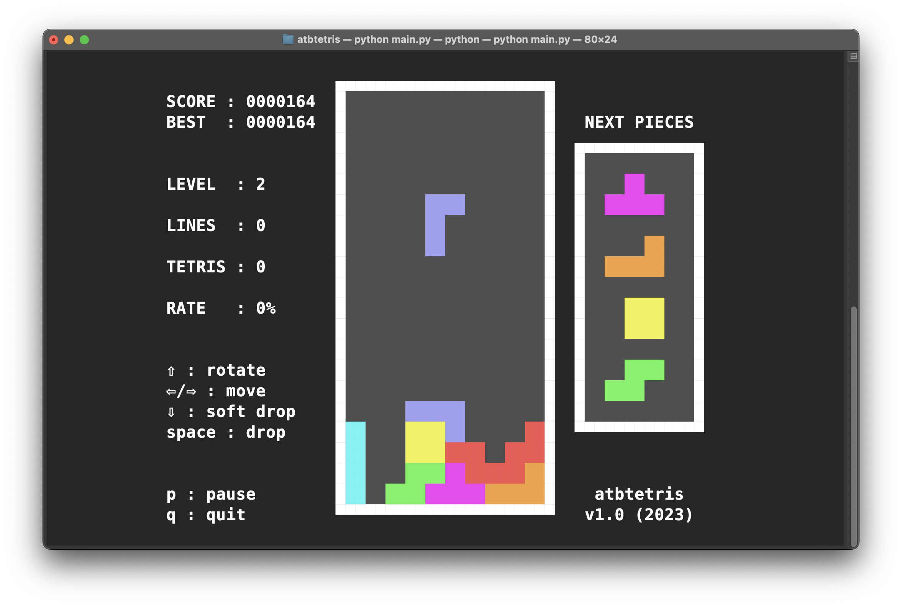

# atbtetris
Another Terminal-Based Tetris Game

## About this project

**atbtetris** is my personal attempt to reproduce the MSX version of Tetris that I loved and played during my youth. It's also a way to explore the `curses` standard Python library.



## How to play

After the game start, fhe commands are:

* **KEY LEFT-RIGHT**: move tile
* **KEY DOWN**: soft drop
* **KEY UP**: rotate tile clockwise
* **SPACE**: hard drop
* **q**: quit game

## Requirements

Since **atbtetris** doesn't need any additional libraries, all you need to play is pure Python installed on your machine. I tested it with Python 3.11.4 on Linux, but it will probably work on other versions and operating systems.

## Docker version

There's also a [Docker version on Docker Hub](https://hub.docker.com/r/zelacerda/atbtetris/tags) that you can use without install any file or dependency. Presuming Docker is installed on your system, use the command below to pull the image and run the containerized version:

```
docker run --rm -it zelacerda/atbtetris
```

Feel free to use, modify and distribute!

**version 1.0 - 2023 - by zelacerda**

